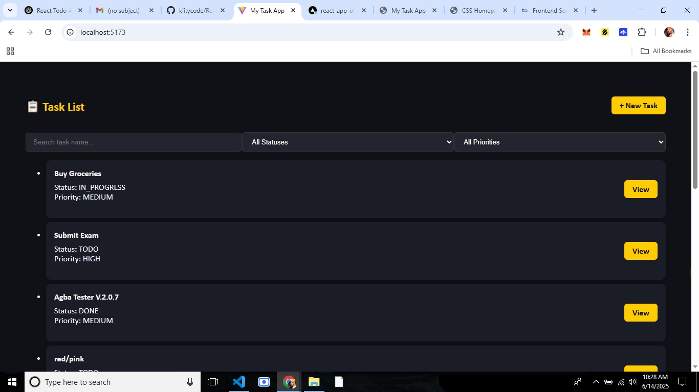
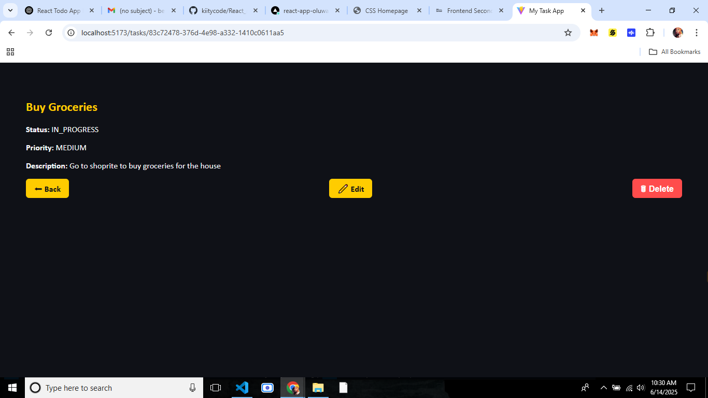
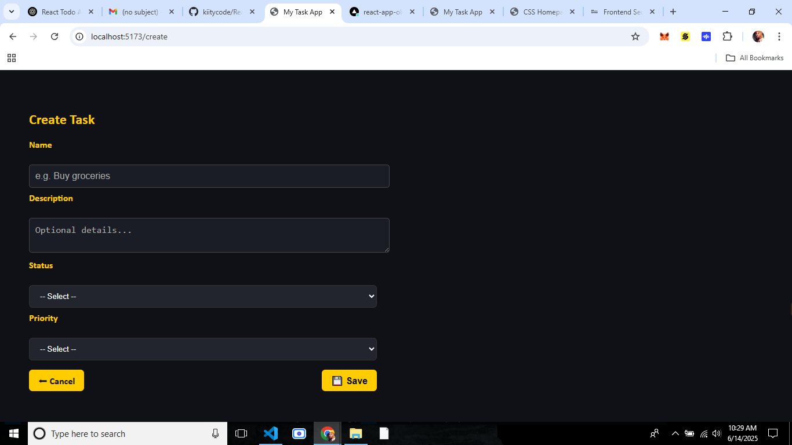
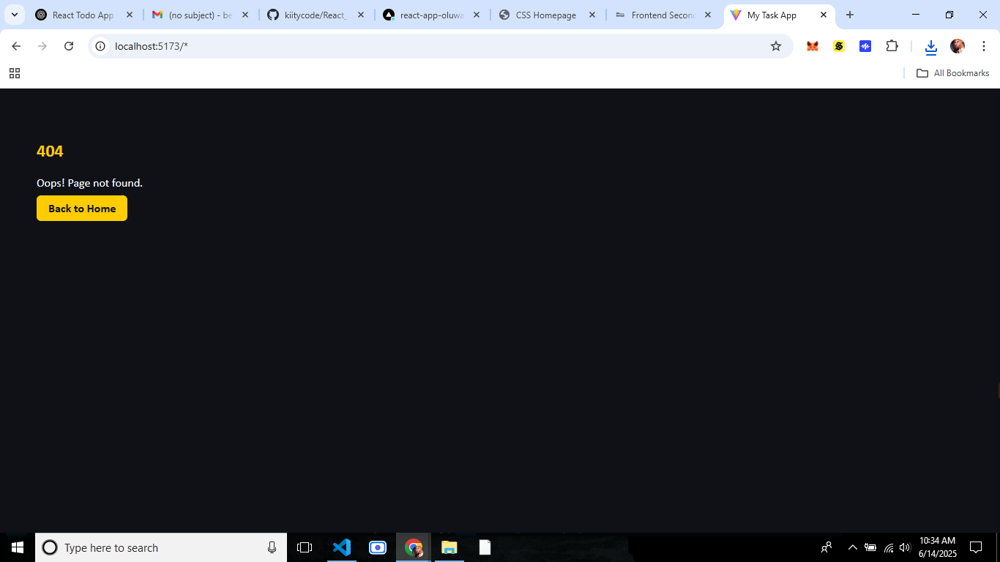
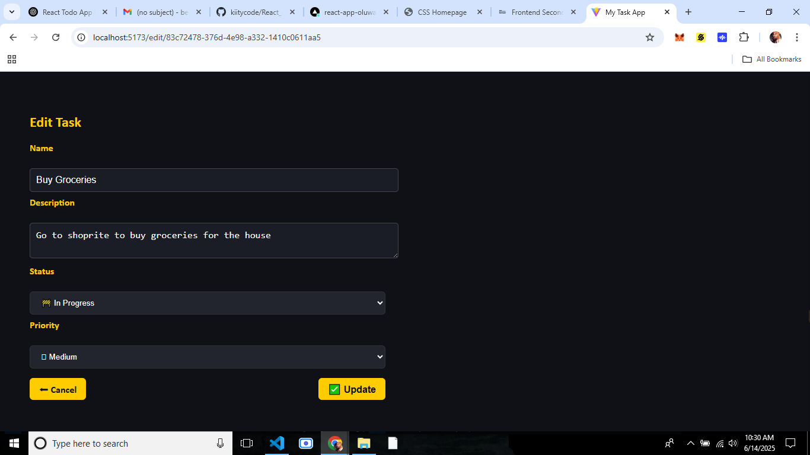

# React Task App – Frontend Engineering Exam Project (Tinyuka24, 2nd Semester)

This is a comprehensive Todo/Task management application built for the AltSchool of Engineering Second Semester Examination (Frontend Track). It seeks to demonstrates modern frontend engineering practices using React and best-in-class tooling to deliver a responsive, accessible, and fully functional SPA.

---

## Features

- Fetch todos from a live REST API: `https://api.oluwasetemi.dev`
- Paginate tasks (client-side): 10 items per page
- Search todos by title
- Filter by status (TODO, IN_PROGRESS, DONE, CANCELLED) and priority (LOW, MEDIUM, HIGH)
- View detailed info for each todo in a nested route
- Create, edit, and delete todos with confirmation
- Persist data in localStorage and IndexedDB (offline support)
- Accessible routing with semantic HTML and ARIA attributes
- Error boundaries and custom 404 error page
- Fully responsive for mobile and desktop
- Dark-mode ready layout (using vibrant but readable custom theme)
- Hosted on Vercel

---

## Tech Stack & Tools

| Category       | Tool / Library                         |
|----------------|----------------------------------------|
| Framework      | [React 19+](https://react.dev)         |
| Routing        | [React Router v7](https://reactrouter.com) |
| Forms          | [React Hook Form](https://react-hook-form.com) |
| API Handling   | `fetch` (custom services)              |
| Offline Caching| [Dexie.js](https://dexie.org) (IndexedDB) |
| Styling        | Vanilla CSS                            |
| UI Components  | ShadCN/UI                              |
| Icons          | React Icons, Lucide React              |

---

## Installation & Setup

```bash
git clone https://github.com/kiitycode/React_app_Oluwatosin.git
cd React_app_Oluwatosin/todo-app
npm install
npm run dev
```

> Make sure you have Node.js and npm installed.

---

## Available Scripts

- `npm run dev` – Start the local development server
- `npm run build` – Build the app for production

---

## Project Structure

```

todo-app/
├── public/
├── src/
│   ├── components/        # ErrorBoundary, shared UI
│   ├── pages/             # Home, DetailPage, CreateTask, EditTask, NotFound, CrashPage
│   ├── hooks/             # useCachedTodos (Dexie & API fallback)
│   ├── services/          # API logic (fetch, create, update, delete)
│   ├── styles/            # CSS styling
│   └── db/                # Dexie.js database setup
├── README.md
└── vite.config.js
```

---

## 🔌 API Documentation

**Base URL:** `https://api.oluwasetemi.dev`

| Method | Endpoint             | Description           |
|--------|----------------------|-----------------------|
| GET    | `/tasks`             | Fetch all tasks       |
| GET    | `/tasks/:id`         | Fetch single task     |
| POST   | `/tasks`             | Create a task         |
| PUT    | `/tasks/:id`         | Update task           |
| DELETE | `/tasks/:id`         | Delete task           |

API fields: `id`, `name`, `description`, `status`, `priority`, `createdAt`

---

## Known Issues

- Some features may not reflect instantly due to simulated latency
- Dark mode works best with supported browsers

---

## Future Enhancements

- Add user authentication (email/password)
- Add light/dark theme switch toggle
- Drag-and-drop task ordering
- Push notification support (via service worker)
- Calendar integration or due date support

---

## Deployment

Hosted live on Vercel →  
🔗 [https://react-app-oluwatosin.vercel.app](https://react-app-oluwatosin.vercel.app)

---

## 📤 Submission Info

- GitHub Repo: [github.com/kiitycode/React_app_Oluwatosin](https://github.com/kiitycode/React_app_Oluwatosin)
- Submission Form: [https://forms.gle/z88UTcnwzC3WPnYH9](https://forms.gle/z88UTcnwzC3WPnYH9)

---

## 📸 Screenshots






```
---

_Developed by Oluwatosin Bolumole for AltSchool Africa_